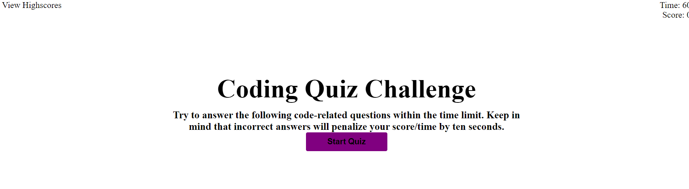

# 04-Web-APIs-02-Homework-IanNicholas

* Assignment asked for a Code Quiz application that has a timer, counts a score, logs it locally, then displays at the end with users entering their initials. 

## HTML

* Basically just mirror imaged the GIF using standrad structure principles.

## CSS

* Again styled to look exactly like the GIF, utilizing the hide class.

## JavaScript

* Grabbing Global variables.
* Very basic and incomplete structure of requirements.
* Incomplete structure

## Screenshots

* 

## LIve Link 

[LInk To My Page](04-Web-APIs-02-Homework-IanNicholas/)
